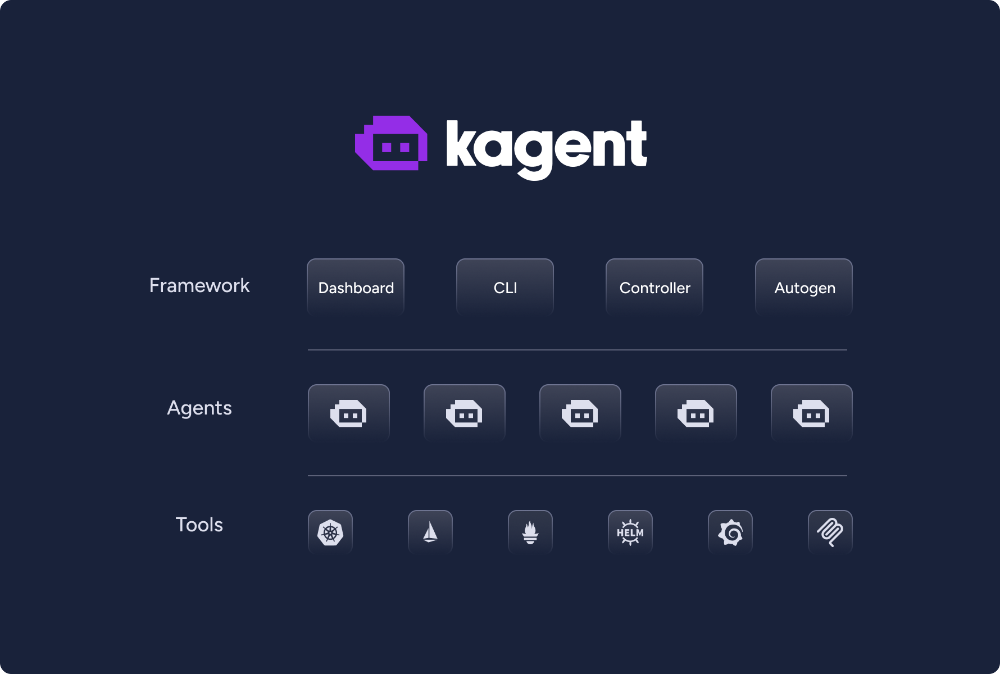
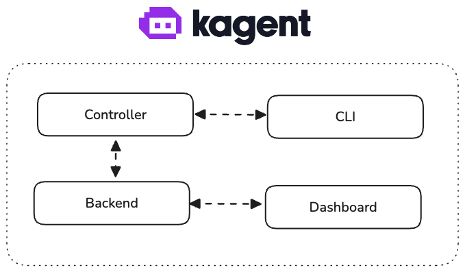

# kagent

kagent is a kubernetes native framework for building AI agents. Kubernets is the most popular orchestration platform for running workloads, and kagent makes it easy to build, deploy and manage AI agents in kubernetes. The kagent framework is designed to be easy to understand and use, and to provide a flexible and powerful way to build and manage AI agents.

  

## Core Concepts

- **Agents**: Agents are the main building block of kagent. They are a system prompt, a set of tools, and a model configuration.
- **Tools**: Tools are any external tool that can be used by an agent. They are defined as kubernetes custom resources and can be used by multiple agents.

All of the above are defined as kubernetes custom resources, which makes them easy to manage and modify.

## Core Principles

- **Kubernetes Native**: Kagent is designed to be easy to understand and use, and to provide a flexible and powerful way to build and manage AI agents.
- **Extensible**: Kagent is designed to be extensible, so you can add your own agents and tools.
- **Flexible**: Kagent is designed to be flexible, to suit any AI agent use case.
- **Observable**: Kagent is designed to be observable, so you can monitor the agents and tools using all common monitoring frameworks.
- **Declarative**: Kagent is designed to be declarative, so you can define the agents and tools in a yaml file.
- **Testable**: Kagent is designed to be tested and debugged easily. This is especially important for AI agent applications.

## Architecture

The kagent framework is designed to be easy to understand and use, and to provide a flexible and powerful way to build and manage AI agents.

  

Kagent has 4 core components:

- **Controller**: The controller is a kubernetes controller that watches the kagent custom resources and creates the necessary resources to run the agents.
- **UI**: The UI is a web UI that allows you to manage the agents and tools.
- **Engine**: The engine is a Python application that runs the agents and tools. The engine is built using [Autogen](https://github.com/microsoft/autogen).
- **CLI**: The CLI is a command line tool that allows you to manage the agents and tools.

## Quick start

1. Install helm, and kubectl.
2. Install the helm chart: `helm install kagent oci://ghcr.io/kagent-dev/kagent/helm/kagent`
3. Port-forward the UI: `kubectl port-forward svc/kagent-ui 8080:80`

## Roadmap

`kagent` is currently in active development. The following is a list of features that are planned for the next few releases.

- [ ] [Observability improvements:](https://github.com/kagent-dev/kagent/issues/130)
  - [ ] More powerful Tracing capabilities
  - [ ] Tighter oTEL integration
  - [ ] Metrics
- [ ] [Feedback/Testing:](https://github.com/kagent-dev/kagent/issues/131)
  - [ ] Eval framework/integrations
  - [ ] Debugging/Time travel
  - [ ] Guided Learning
- [ ] [Runtime/Engine improvements:](https://github.com/kagent-dev/kagent/issues/132)
  - [ ] Mutli-Agent support
  - [ ] True Graph Execution
  - [ ] Workflows
  - [ ] Multiple LLM Provider support
- [ ] [Tools:](https://github.com/kagent-dev/kagent/issues/133)
  - [ ] Tool Discovery
  - [ ] Expose built-in tools as MCP server

## Local development

For instructions on how to run everything locally, see the [DEVELOPMENT.md](DEVELOPMENT.md) file.

## Contributing

For instructions on how to contribute to the kagent project, see the [CONTRIBUTION.md](CONTRIBUTION.md) file.
